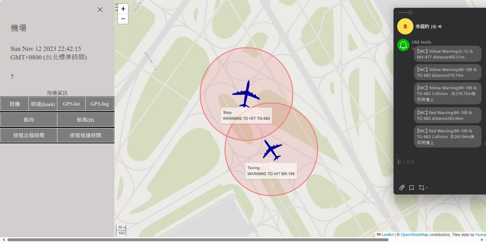
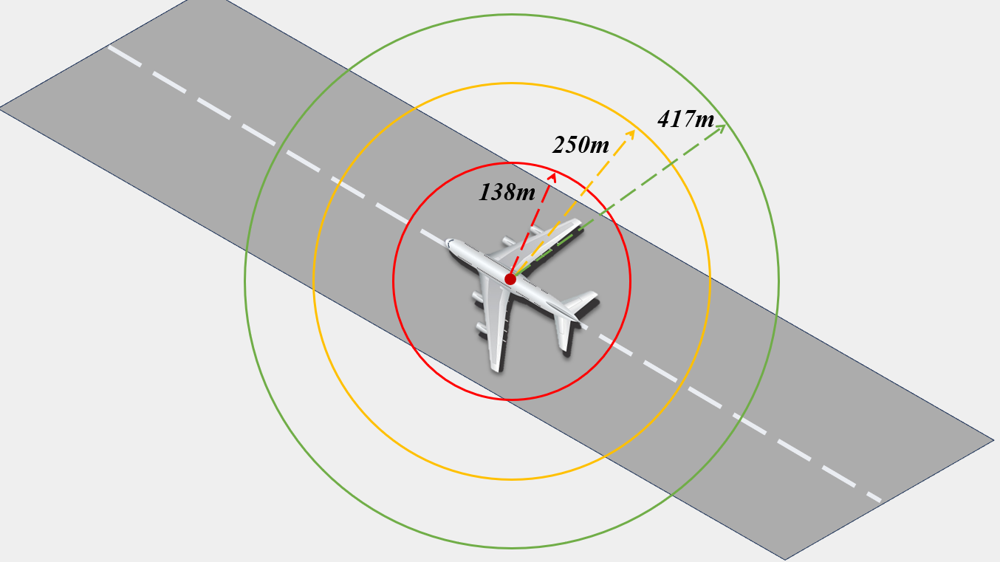
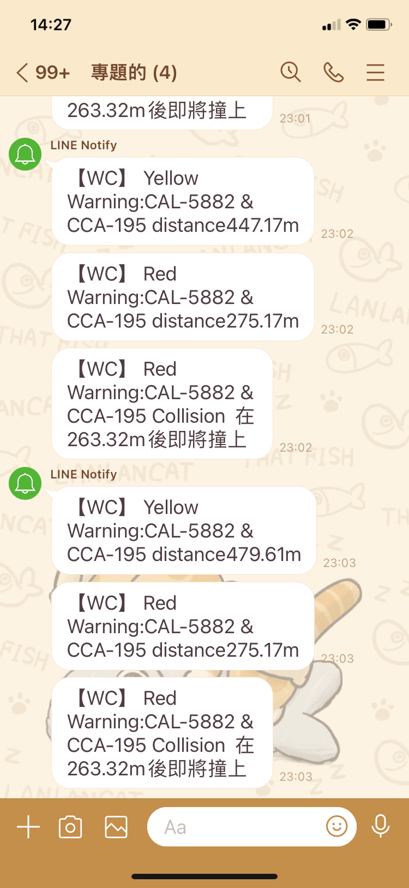
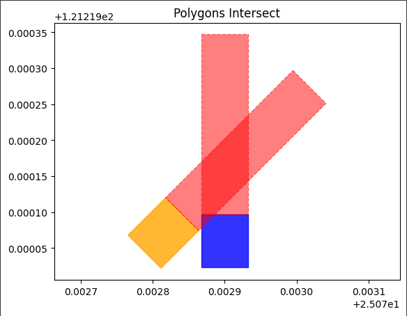
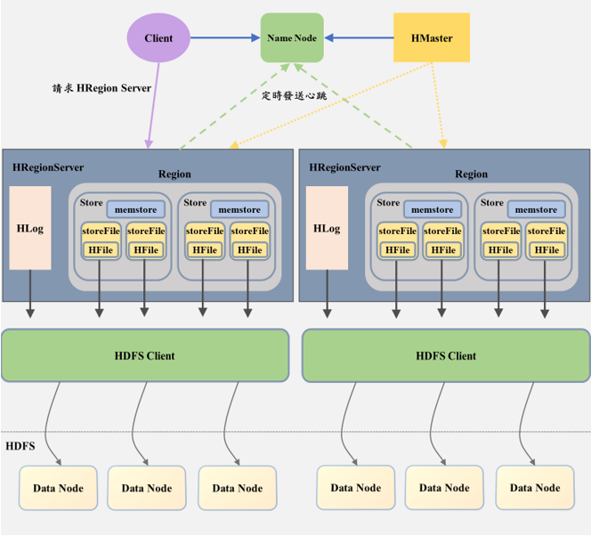

# 動態預測飛機滑行碰撞預防系統

**Dynamic Predictive Flight Taxiing Collision Avoidance System**

國立雲林科技大學 資訊工程系 ｜ 指導教授：張本杰 特聘教授 ｜ 2022/12 - 2023/11

本專題建立一套機場地面滑行碰撞預警系統，整合 ADS-B 航機資料、HBase 分散式儲存、SAT 多邊形碰撞偵測、TTC 碰撞時間估算、OpenStreetMap 視覺化與 LINE Notify 即時警報。系統可針對地面滑行航機預測潛在碰撞風險，並在高風險情境下提前發出黃/紅色警告。

## 專案亮點

- 以 ADS-B 航機資料建立地面滑行狀態監控流程，支援機場場域中的航機位置、速度與航向分析。
- 使用 HBase 儲存航機狀態與警報結果，並透過 Python 後端進行週期性碰撞風險計算。
- 以 SAT (Separating Axis Theorem) 建立機身多邊形相交判斷，搭配 Haversine 距離與 TTC (Time-To-Collision) 估算碰撞風險。
- 建立即時網頁監控介面，使用 Leaflet.js 與 OpenStreetMap 顯示航機位置、警戒圈與警報狀態。
- 整合 LINE Notify，在黃/紅色警戒或預測碰撞時發送即時通知。
- 成功重現 2023/06/10 羽田機場 TG-683 與 BR-189 擦撞事件，系統於碰撞前約 43 秒觸發紅色警告。
- 榮獲雲科大資工系大學部專題競賽第一名。

## 系統展示

### 即時監控地圖與 LINE 警報



系統在 OpenStreetMap 上顯示航機位置、警戒圈與碰撞警報，右側為 LINE Notify 推播示意。

### 三圈警戒區設計



系統以距離建立綠、黃、紅三層警戒區，並搭配 SAT 與 TTC 判斷是否需要升級警報。

### LINE Notify 即時警報



當航機進入警戒範圍或預測可能碰撞時，系統會發送即時警報訊息。

### SAT 碰撞偵測示意



航機會被轉換為帶有方向性的多邊形，系統再透過 SAT 判斷兩架航機的預測區域是否相交。

### HBase + HDFS 架構



系統使用 HBase 儲存即時航機資料與警報狀態，提供後端偵測程式與前端 API 查詢。

## 系統架構

```text
ADS-B 天線 (1090MHz)
    │
    ▼
ADS-B 解碼器 ──► HBase / HDFS ──► MapReduce（過濾地面航機）
                                       │
                                       ▼
                           Python 碰撞偵測主程式 (core/main.py)
                           ├── Haversine 距離計算
                           ├── SAT 多邊形相交偵測
                           ├── TTC 碰撞時間估算
                           └── 綠 / 黃 / 紅警戒判斷
                                       │
                         ┌─────────────┴─────────────┐
                         ▼                           ▼
              Flask API (core/server.py)       LINE Notify 即時警報
                         │
                         ▼
              Leaflet + OpenStreetMap 監控介面
              (web/osmmap.html)
```

## 技術棧

| 類別 | 技術 |
| --- | --- |
| 後端 | Python, Flask, happybase |
| 資料儲存 | Apache Hadoop, HDFS, HBase |
| 演算法 | SAT, TTC, Haversine distance |
| 前端 | HTML, JavaScript, Leaflet.js, OpenStreetMap |
| 通知 | LINE Notify API |
| 資料來源 | ADS-B, FlightAware AeroAPI |

## 主要實作內容

- 設計飛機滑行碰撞預測流程，整合距離門檻、SAT 多邊形相交偵測與 TTC 時間估算。
- 開發 Python 後端程式，從 HBase 讀取 ADS-B 地面航機資料並輸出警報狀態。
- 建立 Flask API，提供航機位置、警戒狀態、距離與碰撞時間等資料給前端使用。
- 建立 OpenStreetMap/Leaflet 前端監控畫面，視覺化航機位置、警戒圈與碰撞警報。
- 整合 LINE Notify，在黃/紅色警戒觸發時發送即時通知。
- 製作羽田機場與桃園機場情境 demo，用於展示系統在真實事件與測試場域中的預警流程。

## 專案結構

```text
airplane-collision-avoidance/
├── core/
│   ├── main.py        # 從 HBase 讀取航機資料，進行碰撞偵測與警報輸出
│   └── server.py      # Flask API，提供航機狀態給網頁前端
├── web/
│   └── osmmap.html    # 網頁監控地圖，使用 Leaflet + OpenStreetMap
├── demo/
│   ├── demo_haneda_v1.py   # 羽田事件模擬 demo
│   ├── demo_haneda_v2.py   # 羽田事件完整模擬 demo
│   ├── demo_taoyuan.py     # 桃園機場測試場景 demo
│   └── README.md
├── docs/
│   ├── images/        # README 展示圖片
│   ├── 專題報告.pdf
│   └── 專題海報.pdf
├── .env.example       # 環境變數範本
├── .gitignore
└── requirements.txt
```

## 安裝與執行

### 前置需求

- Python 3.8+
- 運作中的 HBase 環境
- LINE Notify Token
- FlightAware AeroAPI key，選用，用於查詢航班資訊

### 安裝步驟

```bash
git clone https://github.com/CHUANGCHELUN/airplane-collision-avoidance.git
cd airplane-collision-avoidance

pip install -r requirements.txt

# 設定環境變數
cp .env.example .env
# 編輯 .env，填入 HBASE_HOST、LINE_TOKEN 等
```

### 執行方式

```bash
# 1. 啟動碰撞偵測主程式
python core/main.py

# 2. 另開終端啟動 Flask API
python core/server.py

# 3. 開啟 web/osmmap.html 查看監控地圖

# 4. 選用：執行模擬 demo
python demo/demo_haneda_v2.py
```

> 注意：完整系統需要 HBase 環境。若沒有 HBase，可先透過 README 截圖、專題報告與 demo 程式了解系統流程。

## Demo 說明

`demo/` 內提供不同情境的航機資料寫入腳本，可搭配 `core/main.py` 與 `core/server.py` 展示預警流程。

| 檔案 | 說明 |
| --- | --- |
| `demo_haneda_v1.py` | 羽田機場事件模擬，精簡版 |
| `demo_haneda_v2.py` | 羽田機場事件模擬，完整航機情境 |
| `demo_taoyuan.py` | 桃園機場場域測試情境 |

## 研究成果

- 實際前往桃園國際機場部署測試，確認系統可接收並處理真實 ADS-B 訊號。
- 成功重現 2023/06/10 羽田機場 TG-683 與 BR-189 擦撞事件，系統於碰撞前約 43 秒觸發紅色警告。
- 榮獲雲科大資工系大學部專題競賽第一名。

## 履歷描述

- 以 Python 建立航機滑行碰撞預測流程，整合 Haversine 距離計算、SAT 多邊形相交偵測與 TTC 時間估算。
- 串接 HBase、Flask API 與 Leaflet/OpenStreetMap，視覺化航機位置、警戒圈與碰撞警報。
- 整合 LINE Notify 即時警報，並以羽田機場擦撞事件與桃園機場測試情境驗證系統流程。

## 作者

- 莊哲綸 (Che-Lun Chuang)
- 邱忠憲 (Chung-Hsien Chiu)
- 詹閔勝 (Min-Sheng Chan)

指導教授：張本杰 特聘教授（國立雲林科技大學資訊工程系）
